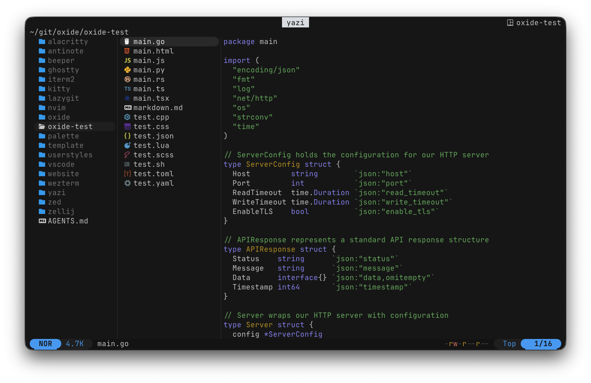

# oxide for yazi

<h6 align="center">
Where function meets form.
</h6>

  
  
  

  

oxide for [Yazi](https://github.com/sxyazi/yazi).

## Installation

Copy [`theme.toml`](./theme.toml) to your Yazi configuration directory:

- Linux/macOS: `~/.config/yazi/theme.toml`
- Windows: `%APPDATA%\yazi\config\theme.toml`

Then restart Yazi.

## Configuration

The theme uses your terminal background. Ensure your terminal is running the oxide colorscheme for the full effect.

## Contributing

PRs welcome. Make sure colors match the palette in the [main repo](https://github.com/oxidescheme/oxide).

## Credits

- **Port Creator:** [@jakmaz](https://github.com/jakmaz)
- **Current Maintainer:** [@jakmaz](https://github.com/jakmaz)
- **Contributors:** See [contributors list](https://github.com/oxidescheme/yazi/graphs/contributors)

## License

MIT License - see [LICENSE](LICENSE) for details.

Copyright &copy; 2026-present oxidescheme

